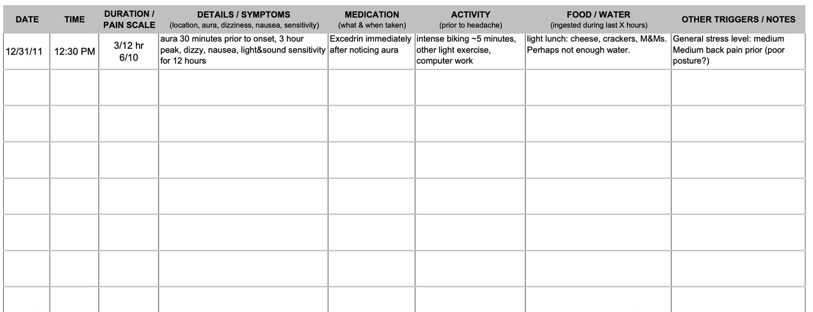
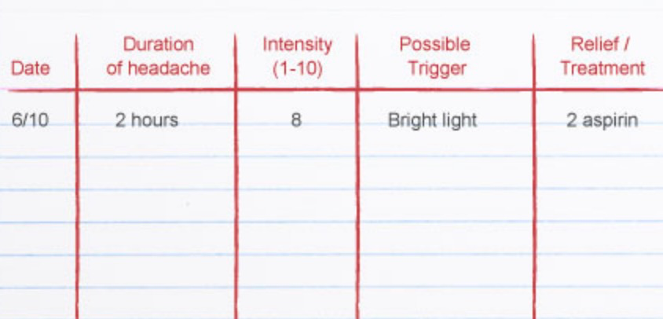
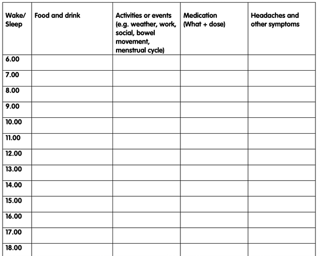

Using Migraine (or a headache) diary can be helpful as you can keep an eye on how often migraines occur. After a while, you might notice some pattern. For example, headaches happened mostly in the morning after you are stressed to wake up late.

The doctor would prescribe you a migraine diary which could look like some of the examples below:
 

There is no problem to use a paper format, of course. However, it is cumbersome to find a pattern or quickly find out how many migraines happened in the last two weeks. Also, paper format diaries create a lot of manual work.

This is why Migraine Detective Team created and improving digital version of migraine diary - Migraine Detective. There are quite a few benefits by using digital versus paper format diaries. Your diary is always with you, and you can use it from any device. There is no app install required. After first entries, the reports are automatically created for you. Even better, some of the possible triggers will be shown. An app is smart enough to remember your most frequent choices and show those tags upfront. That means you don’t need to write coffee in the morning and tea in the afternoon. After while your drinks section (or any other section) will fill with most used tags and you just need to choose the appropriate one. By tags I mean any trigger you want to jot down.
